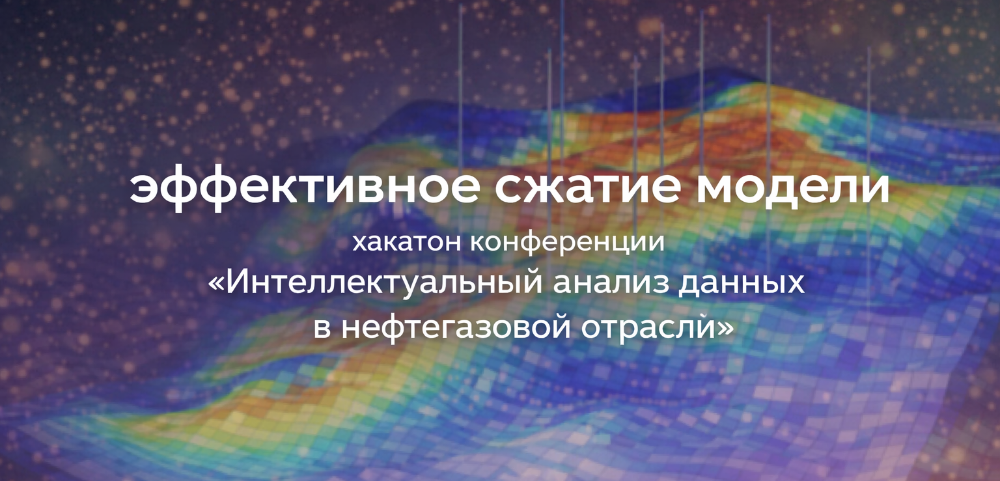
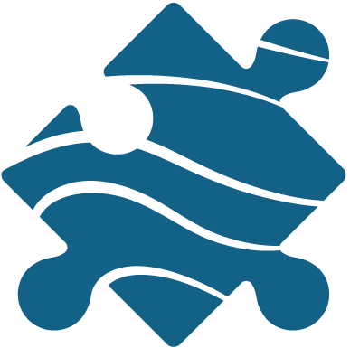
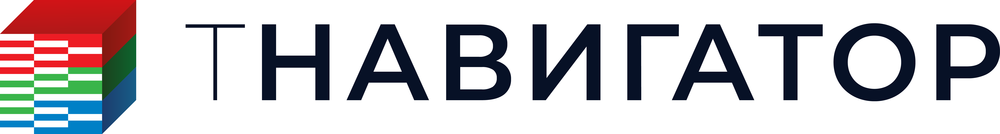
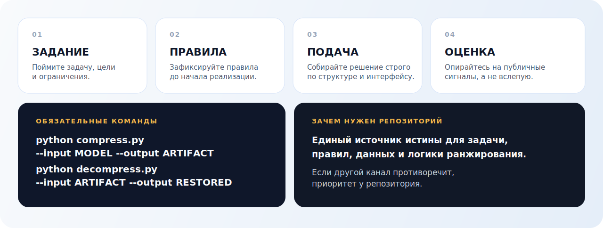

  

<table>
  <tr>
    <td align="center" valign="middle" height="180" width="33%">
      
    </td>
    <td align="center" valign="middle" height="180" width="33%">
      
    </td>
    <td align="right" valign="middle" height="180" width="33%">
      
    </td>
  </tr>
  <tr>
    <td align="center" valign="top" width="33%">
      <strong>Геомодель</strong> 
      Организационная и экспертная площадка.
    </td>
    <td align="center" valign="top" width="33%">
      <strong> Интегрированные разработки для моделирования </strong> 
      Технологический контур и доменная экспертиза.
    </td>
    <td align="center" valign="top" width="33%">
      <strong>Центр Хериот-Ватт ТПУ</strong> 
      Образовательная и исследовательская поддержка.
    </td>
  </tr>
</table>

  <strong>Официальный репозиторий</strong> третьей задачи хакатона в рамках конференции «Интеллектуальный анализ данных в нефтегазовой отрасли».

  Здесь собраны постановка задачи, правила, технические требования к подаче решения, правила оценивания решения и политика таблицы результатов.

> Если описание задачи, правила или технические требования в любом другом канале отличаются от содержимого этого репозитория, приоритет имеет этот репозиторий.

## О задаче

Задача для участников: разработать универсальное решение для сжатия и восстановления файлов гидродинамических моделей в рамках фиксированного технического контракта.

Решение должно:

- принять каталог модели на вход;
- сжать его в стандартизированный артефакт;
- восстановить модель из артефакта;
- сохранить корректную структуру проекта;
- запускаться автоматически в среде проверки организаторов.

## Технологический партнер хакатона – Интегрированные разработки для моделирования

В качестве инструмента для анализа гидродинамических моделей, а также проверки выполнения задания используется программный комплекс тНавигатор. Каждой команде-участнику будет предоставлено программное обеспчение и доступ к лицензионному серверу тНавигатор.

## Формат участия

К участию приглашаются команды от 2 до 5 человек. Подробные правила участия зафиксированы в [docs/rules.md](./docs/rules.md).

## Где смотреть подробности

  

| Раздел документации | Описание |
|---|---|
| [Карта документации](./docs/README.md) | Показывает, в каком файле искать правила, формат данных, контракт и логику оценки |
| [Спецификация задания](./docs/challenge-spec.md) | Определяет задачу, целевые критерии и ограничения |
| [Правила участия](./docs/rules.md) | Фиксирует, что разрешено, что запрещено и что обязательно |
| [Формат данных](./docs/data-format.md) | Описывает структуру входной модели и связанные с ней данные. Содержит ссылку на модель |
| [Контракт подачи решения](./docs/submission.md) | Описывает точную структуру и интерфейс, которым должно соответствовать решение команд |
| [Логика оценки](./docs/evaluation.md) | Объясняет, как работают публичные и приватные проверки |
| [Часто задаваемые вопросы](./docs/faq.md) | Собирает быстрые ответы и ссылки на профильные документы |

## Архитектура репозитория

| Директория | Назначение |
|---|---|
| [docs/](./docs/) | Официальная постановка задачи, контракт, календарь, формат подачи решения, логика оценки и часто задаваемые вопросы |
| [starter-kit/](./starter-kit/) | Docker-окружение для локальной проверки решения |
| [baseline/](./baseline/) | Минимально валидное решение, соответствующее контракту от начала до конца |
| [public_evaluator/](./public_evaluator/) | Система для быстрой проверки решений команд и составления текущего рейтинга |
| [submission_template/](./submission_template/) | Образец структуры репозитория участника |
| [scripts/](./scripts/) | Утилиты для упаковки отправки решения и служебной проверки репозитория |
| [leaderboard/](./leaderboard/) | Рейтинговая таблица команд-участников и политика публикации результатов |

## Практический маршрут участника

1. Прочитайте [спецификацию](./docs/challenge-spec.md) и [правила](./docs/rules.md).
2. Затем изучите [формат данных](./docs/data-format.md) и [контракт подачи решения](./docs/submission.md).
3. Для локальной разработки используйте [starter-kit](./starter-kit/), [baseline](./baseline/) и [public_evaluator](./public_evaluator/).
4. Перед каждой подачей решения сверяйтесь с [логикой оценки](./docs/evaluation.md), [календарем](./docs/timeline.md) и [FAQ](./docs/faq.md).
