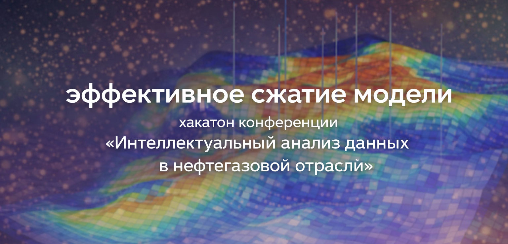
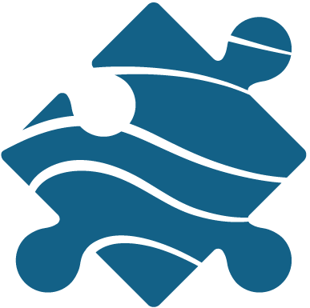
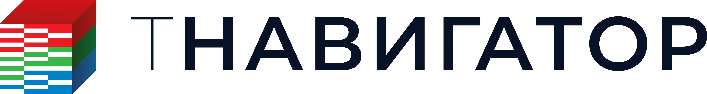
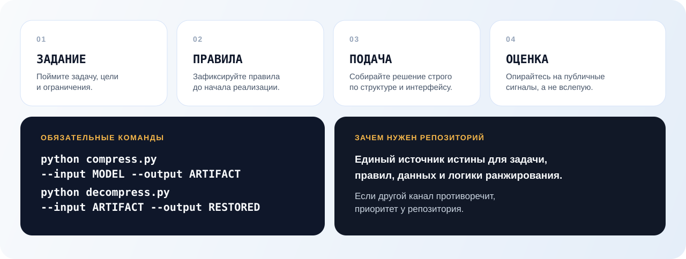

  

## GeoModel Compression Challenge — English summary

> **Status: concluded** (challenge ran April 1 – May 15, 2026; leaderboard
> finalized May 25, 2026). This repository is kept as a public reference —
> the challenge is not accepting new submissions.

This was the third hackathon challenge run at the *"Intelligent Data
Analysis in the Oil and Gas Industry"* conference. Participants built a
general-purpose compressor/decompressor for hydrodynamic reservoir model
files under fixed technical requirements: take a model directory as input,
compress it to a standardized artifact, decompress it back, and preserve the
project structure — runnable unmarked in the organizers' evaluation
environment.

**Organizers:** [Геомодель](https://geomodel.ru/ds26) (organizational and
expert platform), [тНавигатор / RFDynamics](https://rfdyn.com/software/)
(technology partner — tNavigator software was used to inspect models and
validate submissions), and the [Heriot-Watt TPU Center](https://hw.tpu.ru/)
(educational and research support).

**Final leaderboard:** 2 participating teams plus the baseline reference.
Winner: **TomskPolitechnical**, score 97.40, 6.34× compression ratio. See
[`leaderboard/current.csv`](leaderboard/current.csv) for the full table.

**What's in this repository:** the official task specification, rules,
technical submission requirements, evaluation logic, and a public leaderboard
snapshot — see [`docs/`](docs/), [`baseline/`](baseline/) (a minimal valid
reference solution), [`public_evaluator/`](public_evaluator/) (the local
scoring tool), and [`starter-kit/`](starter-kit/) (a Docker environment for
local testing).

**Documentation is in Russian**, matching the participant audience, and is
preserved as-is below and under `docs/` — this section is an orientation
point for other readers, not a translation of it.

---

<table>
  <tr>
    <td align="center" valign="middle" height="180" width="33%">
      
    </td>
    <td align="center" valign="middle" height="180" width="33%">
      
    </td>
    <td align="right" valign="middle" height="180" width="33%">
      
    </td>
  </tr>
  <tr>
    <td align="center" valign="top" width="33%">
      <strong>Геомодель</strong> 
      Организационная и экспертная площадка.
    </td>
    <td align="center" valign="top" width="33%">
      <strong> Интегрированные разработки для моделирования </strong> 
      Технологический контур и доменная экспертиза.
    </td>
    <td align="center" valign="top" width="33%">
      <strong>Центр Хериот-Ватт ТПУ</strong> 
      Образовательная и исследовательская поддержка.
    </td>
  </tr>
</table>

  <strong>Официальный репозиторий</strong> третьей задачи хакатона в рамках конференции «Интеллектуальный анализ данных в нефтегазовой отрасли».

  Здесь собраны постановка задачи, правила, технические требования к подаче решения, правила оценивания решения и ссылка на таблицу результатов участников.

> Если описание задачи, правила или технические требования в любом другом канале отличаются от содержимого этого репозитория, приоритет имеет этот репозиторий.

## О задаче

Задача для участников: разработать универсальное решение для сжатия и восстановления файлов гидродинамических моделей в рамках фиксированных технических требований.

Решение должно:

- принять каталог модели на вход;
- сжать его в стандартизированный артефакт;
- восстановить модель из артефакта;
- сохранить корректную структуру проекта;
- запускаться автоматически в среде проверки организаторов.

## Технологический партнер хакатона – Интегрированные разработки для моделирования

В качестве инструмента для анализа гидродинамических моделей, а также проверки выполнения задания используется программный комплекс тНавигатор. Каждой команде-участнику будет предоставлено программное обеспчение и доступ к лицензионному серверу тНавигатор.

## Формат участия

К участию приглашаются команды от 2 до 5 человек. Подробные правила участия зафиксированы в [docs/rules.md](./docs/rules.md).

## Где смотреть подробности

  

| Раздел документации | Описание |
|---|---|
| [Карта документации](./docs/README.md) | Показывает, в каком файле искать правила, формат данных, требования к решению и логику оценки |
| [Спецификация задания](./docs/challenge-spec.md) | Определяет задачу, целевые критерии и ограничения |
| [Правила участия](./docs/rules.md) | Фиксирует, что разрешено, что запрещено и что обязательно |
| [Формат данных](./docs/data-format.md) | Описывает структуру входной модели и связанные с ней данные. Содержит ссылку на модель |
| [Требования к решению](./docs/submission.md) | Описывает точную структуру и интерфейс, которым должно соответствовать решение команд |
| [Логика оценки](./docs/evaluation.md) | Объясняет, как работают публичные и приватные проверки |
| [Часто задаваемые вопросы](./docs/faq.md) | Собирает быстрые ответы и ссылки на профильные документы |

## Архитектура репозитория

| Директория | Назначение |
|---|---|
| [docs/](./docs/) | Официальная постановка задачи, требования к решению, календарь, формат подачи решения, логика оценки и часто задаваемые вопросы |
| [starter-kit/](./starter-kit/) | Docker-окружение для локальной проверки решения |
| [baseline/](./baseline/) | Минимально валидное решение, соответствующее обязательным требованиям от начала до конца |
| [public_evaluator/](./public_evaluator/) | Локальный оценщик для быстрой проверки и формирования публичной оценки |
| [scripts/](./scripts/) | Утилита для упаковки отправки решения |
| [leaderboard/](./leaderboard/) | Публичные срезы таблицы результатов и политика публикации результатов |

## Практический маршрут участника

1. Прочитайте [спецификацию](./docs/challenge-spec.md) и [правила](./docs/rules.md).
2. Затем изучите [формат данных](./docs/data-format.md) и [требования к решению](./docs/submission.md).
3. Для локальной разработки используйте [starter-kit](./starter-kit/), [baseline](./baseline/) и [public_evaluator](./public_evaluator/).
4. Перед каждой подачей решения сверяйтесь с [логикой оценки](./docs/evaluation.md), [календарем](./docs/timeline.md) и [FAQ](./docs/faq.md).
