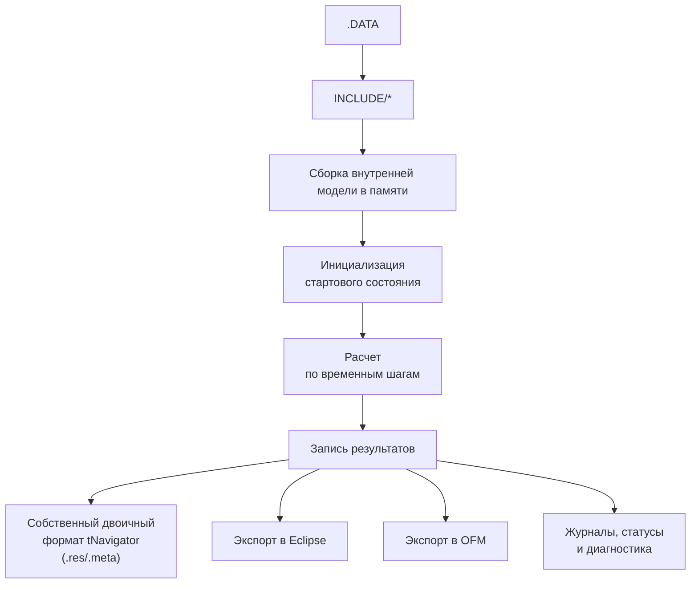
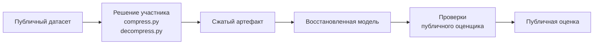

# Формат данных

## Обзор

Публичные данные распространяются отдельно от GitHub, а этот репозиторий содержит:

- прямую ссылку на публичную модель;
- описание структуры данных;
- примеры чтения и вспомогательные утилиты.

## Где хранятся данные?
Тренировочная геолого-гидродинамическая модель доступна [по ссылке](https://drive.google.com/drive/folders/1bw59RdD6QX-BJ3WxzGCspIhZNFTXV6gv?usp=sharing "Google Drive") для скачивания.

Для старта достаточно скачать модель из Google Drive, распаковать её локально и работать с каталогом напрямую. Отдельная таблица ссылок, проверка контрольных сумм и специальный скрипт скачивания со стороны участника не требуются.

## Структура входной модели

Для решения поставленной задачи участники получают каталог проекта tNavigator. Этот каталог состоит из текстовых и бинарных файлов, которые tNavigator читает как единую модель, собирает во внутреннюю структуру и затем использует для расчета.

Типовой проект нужно понимать так:

| Элемент | Роль в проекте | Что обычно содержит | Значение для задачи сжатия |
|---|---|---|---|
| `.DATA` | Корневой файл проекта | Общую структуру модели и подключения через `INCLUDE` | Обязательная точка входа в проект |
| `INCLUDE/` | Основное описание постановки | 3D-сетку, свойства породы и флюидов, начальное состояние, траектории скважин, режимы работы скважин и выходные параметры | Основной содержательный слой модели |
| `USER/` | Пользовательские расширения | Скрипты Python и пользовательские настройки | Часть воспроизводимого проекта, если используется решением |
| `.snf/` | Служебные данные интерфейса | Кэш и внутренние данные графического интерфейса tNavigator | Не является основным источником физической постановки, но может присутствовать во входном каталоге |
| `RESULTS/` | Результаты выполненного расчета | Двоичные результаты tNavigator, экспорты в Eclipse и OFM, журналы и диагностические файлы | Производный слой, который нужно явно учитывать в политике сжатия |

### Пример дерева каталогов

```text
public-model-01/
├── MODEL.DATA
├── INCLUDE/
│   ├── GRID/
│   │   ├── grid.inc
│   │   └── faults.inc
│   ├── ROCK/
│   │   ├── porosity.inc
│   │   └── permeability.inc
│   ├── FLUID/
│   │   └── pvt.inc
│   ├── INIT/
│   │   └── initial_state.inc
│   ├── WELLS/
│   │   ├── trajectories.inc
│   │   └── schedule.inc
│   └── OUTPUT/
│       └── summary.inc
├── USER/
│   ├── hooks.py
│   └── settings.yaml
├── .snf/
│   ├── cache.bin
│   └── ui-state.json
└── RESULTS/
    ├── native/
    │   ├── case.res
    │   └── case.meta
    ├── eclipse/
    │   ├── case.UNRST
    │   └── case.SMSPEC
    ├── ofm/
    │   └── export.dat
    └── logs/
        ├── run.log
        └── status.txt
```

### Поток обработки проекта в tNavigator



## Требования к обработке входных данных

- чтение модели из корневого пути;
- корректная обработка вложенной структуры;
- сохранение обязательных файлов проекта;
- сохранение согласованности метаданных после восстановления.

Другими словами, у вас должно получиться открыть модель после сжатия и восстановления в графическом интерфейсе tNavigator (или в консольной версии).

Если во входном каталоге присутствуют `.snf/` и `RESULTS/`, политика их обработки должна быть предсказуемой: решение не должно случайно терять эти каталоги или изменять их смысл без явного описания подхода. 

## Публичные и приватные данные

| Контур данных | Назначение |
|---|---|
| Публичные данные | Локальная разработка и публичная оценка. Модель доступна [по ссылке](https://drive.google.com/drive/folders/1bw59RdD6QX-BJ3WxzGCspIhZNFTXV6gv?usp=sharing "Google Drive") |
| Приватные данные | Финальное ранжирование на скрытых моделях для проверки универсальности решения команд |

Содержимое приватного датасета не раскрывается. Это значит, что в финале хакатона организаторы будут тестировать ваши алгоритмы на другой геолого-гидродинамической модели.

## Поток данных




## Сопутствующие Материалы

- [Стартовый набор](../starter-kit/README.md)
- [Скрипты](../scripts/README.md)
