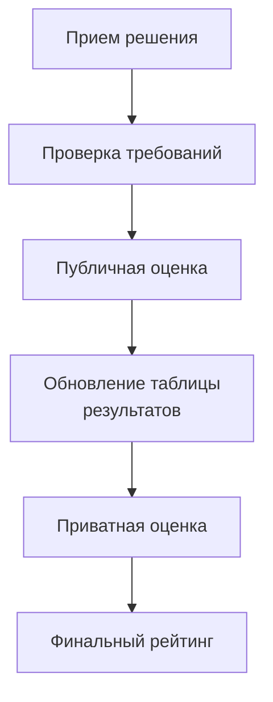

# Логика оценки
Для самостоятельной проверки вашего решения можно и нужно пользоваться программным пакетом tNavigator. Каждой команде будет выдан доступ к лицензионному серверу ПО. 
## Модель оценки

| Слой | Роль |
|---|---|
| Публичная оценка | Помогает участникам итеративно улучшать решение. Проверка проходит на открытом наборе данных. |
| Приватная оценка | Определяет финальный рейтинг на скрытых данных |

Финальный результат определяется финальной приватной валидацией, а не текущей публичной таблицей результатов.

## Конвейер оценки

## Уровни валидации

1. Проверка требований.
2. Публичная оценка.
3. Приватная оценка.
4. Дополнительная финальная валидация для лучших решений.

Точные технические требования к входной поставке описаны в [submission.md](./submission.md).

## Необходимое условие для проверки решения:

Подача решения считается невалидной, если:

- решение не запускается;
- выходные артефакты некорректны;
- восстановленная модель не проходит структурные проверки;
<!-- - нарушены лимиты по времени, памяти или формату; комм. мы не задаём такие лимиты -->
<!-- так и не поняла что оно включает - обнаружено запрещенное поведение. --> 

## Семейство метрик

| Метрика | Что означает |
|---|---|
| Коэффициент сжатия | Насколько хорошо решение уменьшает объем модели |
| Время сжатия | Скорость работы алгоритма сжатия |
| Время восстановления | Скорость работы алгоритма восстановления |
| Единая метрика точности восстановления | Насколько точно восстановлено содержимое модели с учетом допуска по float и важности файлов |
| Структурная целостность | Корректность структуры восстановленного проекта с учетом обязательных файлов, графа `INCLUDE`, лишних файлов и, при наличии, проверки через tNavigator |

## Логика агрегации

Публичная оценка ориентируется на:

- эффективность сжатия;
- качество восстановления;
- структурную корректность;
- скорость.

Для публичного `public_score` используется quality-first агрегация:

- предметная точность имеет наибольший вес;
- структурная целостность оценивается не только по наличию путей, но и по графу `INCLUDE`;
- коэффициент сжатия считается по логарифмической шкале, чтобы каждое удвоение давало сопоставимую прибавку;
- скорость имеет ограниченный вес и не должна перебивать качество восстановления.

Приватная оценка использует те же классы показателей, но считается на скрытых данных и с более строгими проверками.

## Политика таблицы результатов

- Таблица результатов отражает только публичные результаты.
- Обновление происходит по расписанию.
- Реального времени для всех отправок решения нет.
- Приватная детализация не публикуется.

Подробности формата публикации описаны в [leaderboard/README.md](../leaderboard/README.md).

## Разрешение ничьих

Если итоговые приватные оценки совпадают, приоритет определяется последовательно:

1. Лучшее качество восстановления.
2. Меньшее время выполнения.
3. Более ранняя корректная финальная подача решения.
